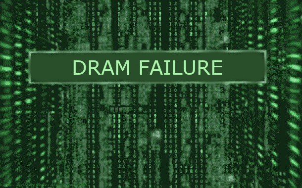

--------------------------------------------------
DFault v.0.1.
--------------------------------------------------
DFault is a Workload-Aware DRAM Error Prediction Framework.

--------------------------------------------------
Description
--------------------------------------------------
The framework uses a ML model (KNN, K-Nearest Neighbors Algorithm
) to predict the rate of single bit errors per 64-bit word (WER) and the probability to obtain an Uncorrectable Error (when > 2 bits are corrupted in a 64-bit word). The model is trained using the results of a 3-month DRAM error characterization campaign on ARM-based (X-Gene2) server under varying DRAM voltage, refresh rate and temperature.

The detailed description of the tool is provided in the following paper:
...

--------------------
Required packages:
--------------------
1. python
2. pickle

--------------------
How to run?:
--------------------
./dfault.py

--------------------
Acknowledgement:
--------------------

This work is funded by the H2020 Framework Program of the
European Union through the UniServer Project (Grant Agreement
688540) – http://www.uniserver2020.eu.

